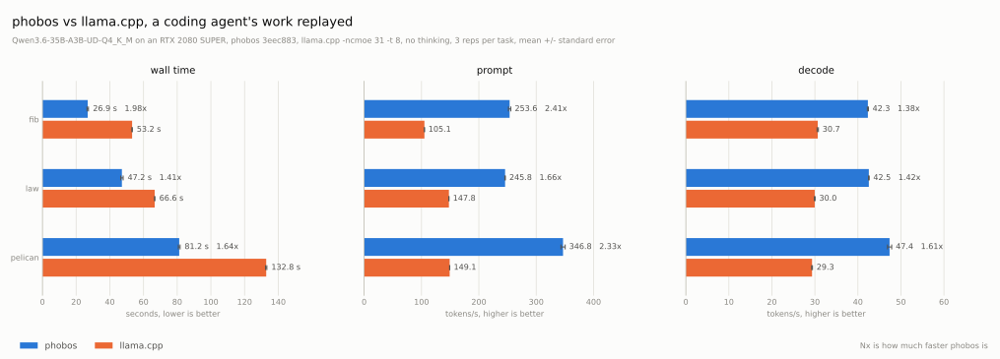

# Benchmarks

Phobos offers `phobos-bench` which measures prompt processing (pp) and
token generation (tg) throughput.

See [details](#details) for information on how to run these benchmarks locally.
`scripts/bench.py` measures Phobos and llama.cpp interleaved, and checks the
card for contention first.





Qwen3.5-0.8B-Q8_0 on an RTX 2080 SUPER, driver 617.14, tokens per second:

| test   | llama.cpp CUDA[^1]  | Phobos GPU         |
| ------ | ------------------: | -----------------: |
| pp128  |  6723.91 +/-  12.97 | 5976.29 +/- 179.57 |
| pp512  | 10729.32 +/-  26.75 | 8693.19 +/-  38.57 |
| tg32   |   229.87 +/-   0.22 |  325.00 +/-   0.66 |
| tg128  |   246.98 +/-   0.03 |  323.94 +/-   0.11 |
| tg512  |   250.23 +/-   0.05 |  324.50 +/-   0.06 |
| tg1024 |   249.84 +/-   0.12 |  323.53 +/-   0.14 |
| tg2048 |   248.61 +/-   0.07 |  322.09 +/-   0.10 |

MiniCPM5-1B-Q8_0 on an RTX 2080 SUPER, driver 617.14, tokens per second:

| test   | llama.cpp CUDA[^1]  | Phobos GPU          |
| ------ | ------------------: | ------------------: |
| pp128  |  8569.34 +/-  16.46 |  7574.73 +/-  27.89 |
| pp512  | 16164.09 +/-  20.50 | 10086.13 +/-  26.26 |
| tg32   |   270.33 +/-   0.27 |   315.18 +/-   0.25 |
| tg128  |   270.89 +/-   0.19 |   314.19 +/-   0.15 |
| tg512  |   269.83 +/-   0.17 |   313.14 +/-   0.11 |
| tg1024 |   268.98 +/-   0.28 |   310.84 +/-   0.05 |
| tg2048 |   266.84 +/-   0.20 |   304.84 +/-   1.00 |

Qwen3.5-4B-Q4_K_M on an RTX 2080 SUPER, driver 617.14, tokens per second:

| test   | llama.cpp CUDA[^1] | Phobos GPU         |
| ------ | -----------------: | -----------------: |
| pp128  | 2296.17 +/-   3.53 | 2305.30 +/-   3.32 |
| pp512  | 2956.21 +/-   1.31 | 2372.05 +/-   2.44 |
| tg32   |  103.60 +/-   0.08 |  111.92 +/-   0.14 |
| tg128  |  106.54 +/-   0.11 |  111.75 +/-   0.14 |
| tg512  |  106.77 +/-   0.29 |  111.54 +/-   0.42 |
| tg1024 |  107.01 +/-   0.12 |  111.59 +/-   0.26 |
| tg2048 |  106.50 +/-   0.12 |  111.43 +/-   0.10 |

GLM-4.6V-Flash-Q4_K_M, text only, on an RTX 2080 SUPER, driver 617.14, tokens per second:

| test  | llama.cpp CUDA[^1] | Phobos GPU         |
| ----- | -----------------: | -----------------: |
| pp128 | 1665.23 +/-  63.55 | 1384.87 +/-   1.66 |
| pp512 | 1974.65 +/-   8.10 | 1160.08 +/-   2.47 |
| tg128 |   63.23 +/-   0.01 |   59.69 +/-   0.02 |

Qwen3.8-27B-UD-IQ1_M on an RTX 2080 SUPER, driver 617.14, tokens per second:

| test  | llama.cpp CUDA[^1] | Phobos GPU      |
| ----- | -----------------: | --------------: |
| pp128 |   473.17 +/-  0.85 | 537.82 +/- 0.00 |
| tg128 |    21.69 +/-  0.00 |  30.98 +/- 0.01 |

Ternary-Bonsai-2-27B-PTQ1_0 on an RTX 2080 SUPER, driver 617.14, tokens per second:

| test  | llama.cpp-prism CUDA[^2] | Phobos GPU        |
| ----- | -----------------------: | ----------------: |
| pp128 |         469.76 +/-  0.40 | 583.99 +/- 10.82  |
| tg128 |          48.54 +/-  0.23 |  45.25 +/-  0.23  |

The two 27B models need 6.27 GiB (IQ1_M) and 5.53 GiB (PTQ1_0) for their
weights, which leaves little of the card's 8 GiB. Their numbers only hold while
the desktop uses little VRAM: 886 MiB was in use before the IQ1_M run, and
682 MiB before the PTQ1_0 run. If the desktop uses much more, the model no
longer fits and the driver pages it over PCIe. An earlier session measured
that at 7 t/s.

## Mixture of Experts

Qwen3.6-35B-A3B-UD-Q4_K_M, a mixture of 256 experts whose 19.5 GB do not fit the card, on an RTX 2080 SUPER, driver 617.14, tokens per second:

| test  | llama.cpp CUDA[^1], `-ncmoe 31 -t 8` | Phobos GPU       |
| ----- | -----------------------------------: | ---------------: |
| pp128 |                      76.25 +/-  0.12 | 311.55 +/- 4.16  |
| pp512 |                     257.57 +/-  0.55 | 577.88 +/- 1.13  |
| tg128 |                      29.88 +/-  1.64 |  54.32 +/- 0.19  |

Both engines keep everything except the experts on the GPU. They differ in
where the experts go.

**llama.cpp** decides at load time which layers keep their experts on the CPU.
We used its fastest setting on this card, found by sweeping `llama-bench` at a
3k context:

- `-ncmoe 31`: experts of the first 31 layers on the CPU. At 30 the card is at
  the edge of running out of memory, and at 29 it starts paging.
- `-t 8`: 8 CPU threads decode 12% faster than the default.

**Phobos** keeps a cache of experts on the GPU, sized so the context still has
room to grow.

- Decode: experts in the cache run on the GPU. At the same time, CPU threads
  compute the missing experts from host memory. That takes a quarter of the
  time copying the expert to the GPU would. The CPU hands its results to the
  GPU through mapped memory.
- Prompt processing: Phobos copies experts to the GPU over PCIe and computes
  the rest on the CPU at the same time.

The link on this machine is PCIe 3.0 x8, 6.4 GB/s.

## Real-World Load

The tables above come from a synthetic benchmark. `scripts/agent_bench.py`
measures a real workload instead:

1. It runs the [pi](https://pi.dev) coding agent on the tasks in `bench/` and
   records every request the agent sends.
2. It replays the recording to each engine, with every answer capped at its
   recorded length. Both engines get the same prompts in the same order. Each
   keeps its session between requests and rewinds it to where the next prompt
   differs.

The model is Qwen3.6-35B-A3B. Both engines use the same sampler, a 16k context
and one slot, and llama.cpp uses the settings above. One recording of each task
in `bench/`, replayed three rounds each, without thinking:

| task      | requests | engine         | wall    | prompt  | decode   |
| --------- | -------: | -------------- | ------: | ------: | -------: |
| `fib`     |        6 | llama.cpp CUDA |  53.2 s | 105 t/s | 30.7 t/s |
|           |          | Phobos GPU     |  26.9 s | 254 t/s | 42.3 t/s |
| `law`     |        2 | llama.cpp CUDA |  66.6 s | 148 t/s | 30.0 t/s |
|           |          | Phobos GPU     |  47.2 s | 246 t/s | 42.5 t/s |
| `pelican` |        2 | llama.cpp CUDA | 132.8 s | 149 t/s | 29.3 t/s |
|           |          | Phobos GPU     |  81.2 s | 347 t/s | 47.4 t/s |

The replay caps each answer at its recorded length, but it cannot make an
engine keep going. On `fib` Phobos ends one answer early and writes 636 tokens
a round to llama.cpp's 733, so its wall time there covers a little less work.
The rates are per token and compare as they are.

The context grows to 3k tokens on `fib`, 6.6k on `law` and 4.9k on `pelican`.
That is why decode is slower here than in the benchmark tables.

An earlier session replayed an 8-request `fib` recording with thinking:

| thinking         | wall    | prompt    | decode     | tokens/round |
| ---------------- | ------: | --------: | ---------: | -----------: |
| llama.cpp CUDA   | 149.1 s | 105 t/s   | 30.1 t/s   |        2,005 |
| Phobos GPU       | 147.8 s | 193 t/s   | 42.0 t/s   |       ~4,400 |

With thinking, the two wall times cover different amounts of work. llama.cpp
ends the long reasoning turn early, so Phobos writes about twice as many tokens
in the same time.

## Under Memory Pressure

A desktop does not leave the card alone. A browser, a game or a second model
can take a share of its memory at any time. An earlier session replayed its
8-request fib recording, and before the fourth request another process took
2 GiB of the card's 8 and kept writing to it until the task ended. Both engines
loaded against the whole card. Three rounds each:

| engine         | wall    | prompt  | decode   |
| -------------- | ------: | ------: | -------: |
| llama.cpp CUDA | 169.4 s | 55 t/s  | 12.2 t/s |
| Phobos GPU     |  55.3 s | 191 t/s | 36.4 t/s |

The same rates split at the squeeze:

| engine         | decode before | decode after | kept | prompt before | prompt after |
| -------------- | ------------: | -----------: | ---: | ------------: | -----------: |
| llama.cpp CUDA |      32.3 t/s |      9.2 t/s |  28% |       126 t/s |       29 t/s |
| Phobos GPU     |      44.8 t/s |     33.3 t/s |  74% |       289 t/s |      120 t/s |

llama.cpp can buy room for the squeeze up front. With the experts of five more
layers on the CPU (`-ncmoe 36`), it doesn't notice the squeeze at all, but it
is slower without one, too:

| engine                    | wall   | decode before | decode after | prompt before | prompt after |
| ------------------------- | -----: | ------------: | -----------: | ------------: | -----------: |
| llama.cpp CUDA, `-ncmoe 36` | 78.3 s |      27.7 t/s |     28.2 t/s |       116 t/s |      107 t/s |

**llama.cpp** fixed its split at load time. When the card runs out of memory,
the driver pages its buffers to host memory, and every token reads them back
over PCIe.

**Phobos** checks the whole card's free memory between passes. When another
process fills the card, the expert cache gives the memory back. Here that took
two steps within a few seconds, from 38 to 14 experts a block. More misses go
to the CPU threads, but nothing is paged. When the memory is free again, the
cache takes it back.

Without the squeeze, Phobos replays this trace in 43.5 s.

The other program can also close again. In this run the squeeze starts
before the third request and ends before the sixth, so each phase gets three
requests. llama.cpp three rounds, Phobos two:

| engine         | wall    | decode before | during   | after    |
| -------------- | ------: | ------------: | -------: | -------: |
| llama.cpp CUDA | 131.7 s |      31.1 t/s |  9.0 t/s | 31.2 t/s |
| Phobos GPU     |  52.4 s |      45.9 t/s | 30.8 t/s | 44.6 t/s |

Both engines recover. llama.cpp waits for the driver to page its buffers back
in. Phobos grows its cache from 14 back to 39 experts a block, the size it had
before the squeeze.

The raw results are `results/agent-squeeze.json`, `results/agent-squeeze-ncmoe36.json`
and `results/agent-squeeze-release.json`.

## Details

The 0.8B, MiniCPM5-1B and 4B tables come from one run of both engines.

```bash
python scripts/bench.py -p 128 512 -n 32 128 512 1024 2048 -r 3 -R 5 \
  --csv results/bench.csv --json results/bench.json
```

GLM-4.6V-Flash fills most of the card, so it measures two prompt sizes and one
generation size.

```bash
python scripts/bench.py -m models/GLM-4.6V-Flash-Q4_K_M.gguf -p 128 512 -n 128 \
  -r 3 -R 3 --csv results/bench-glm.csv --json results/bench-glm.json
```

The Qwen 27B is slow, so this run uses fewer sizes and repetitions. It is also
close to the card's memory limit, so it measures only one prompt size and one
generation size.

```bash
python scripts/bench.py -m models/Qwen3.8-27B-UD-IQ1_M.gguf -p 128 -n 128 \
  -r 1 -R 3 --csv results/bench-qwen38.csv --json results/bench-qwen38.json
```

The ternary 27B, against PrismML's llama.cpp fork.

```bash
python scripts/bench.py -m models/Ternary-Bonsai-2-27B-PTQ1_0.gguf -p 128 -n 128 \
  -r 1 -R 3 --llama-bench ${llama_cpp_prism}/llama-bench.exe \
  --csv results/bench-bonsai.csv --json results/bench-bonsai.json
```

The 35B mixture of experts model. llama.cpp runs its experts for layers 0 to 30
on the CPU (`-ncmoe 31`) with 8 threads (`-t 8`). This was its fastest
setting on the RTX 2080 SUPER at a 3k context.

```bash
python scripts/bench.py -m models/Qwen3.6-35B-A3B-UD-Q4_K_M.gguf -p 128 512 -n 128 \
  -r 1 -R 3 --llama-args="-ncmoe 31 -t 8" \
  --csv results/bench-qwen36moe.csv --json results/bench-qwen36moe.json
```

Record a [pi](https://pi.dev) session of every task, then replay it to both
engines and plot the result.

```bash
python scripts/agent_bench.py --engines phobos -r 1 --out RUN [--thinking]
python scripts/agent_bench.py -r 3 [--thinking] --replay RUN/phobos-rep1-*.requests.jsonl \
  --llama-arg=-ncmoe --llama-arg=31 --llama-arg=-t --llama-arg=8 --out REPLAY
cp REPLAY/results.json results/agent.json
python scripts/plot_agent.py results/agent.json -o results/agent.svg --context \
  "Qwen3.6-35B-A3B-UD-Q4_K_M on an RTX 2080 SUPER, phobos 3eec883, llama.cpp -ncmoe 31 -t 8, no thinking"
```

The same replay with 2 GiB of the card taken by another process from the
fourth request on. `--squeeze-at 3 --squeeze-until 6` takes it before the
third request and gives it back before the sixth.

```bash
python scripts/agent_bench.py -r 3 --replay RUN/phobos-rep1-fib.requests.jsonl --squeeze \
  --llama-arg=-ncmoe --llama-arg=31 --llama-arg=-t --llama-arg=8
```

Producing the SVG for the results.

```bash
python scripts/plot.py results/bench.json results/bench-glm.json results/bench-qwen38.json \
  results/bench-bonsai.json results/bench-qwen36moe.json -o results/inference.svg
```

Manually invoking the engines (not a comparison).

```bash
llama-bench -p 512 -n 128 -m ${models}/Qwen3.5-0.8B-Q8_0.gguf -r 10
cargo run --features cuda --release -p phobos-bench -- -m ${models}/Qwen3.5-0.8B-Q8_0.gguf -p 512 -n 128 -r 10
```

Measuring cuBLAS/GEMM performance. It's a separate benchmark that autotunes the
kernels.

```bash
cargo run -r -p phobos-kbench -- --csv results/results.csv
python scripts/plot_bench.py results/results.csv -o results/bench.svg
```

[^1]: build: 4d19b2876 (10636)
[^2]: [PrismML's llama.cpp fork](https://github.com/PrismML-Eng/llama.cpp), build: 2459f68b5 (10754)
