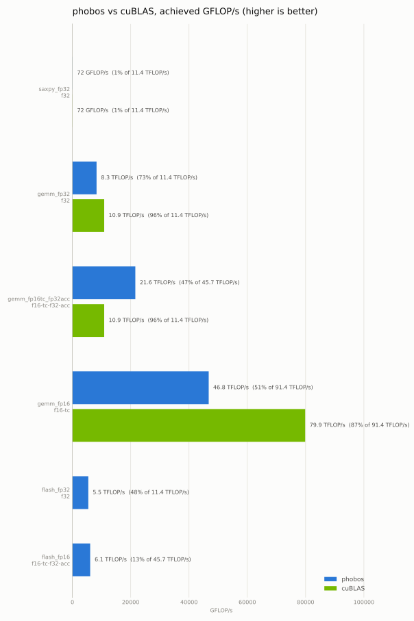
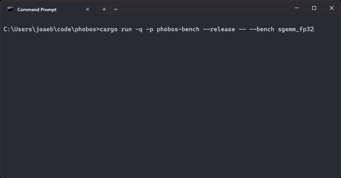

# phobos

**EXPERIMENTAL** Tile-based kernel language for distributed tensor algebra. Inspired by [Triton](https://triton-lang.org).

```plain
@cluster(TILE_M in [16384, 65536], TILE_N in [16384, 65536], TILE_K in [16384, 65536])
@autotune(TILE_M in [32, 256], TILE_N in [32, 256], TILE_K in [4, 32])
kernel gemm(A: tensor<f32>[M, K],
             B: tensor<f32>[K, N],
             C: tensor<f32>[M, N],
             alpha: f32,
             beta: f32) {
  let pm = program_id(0)
  let pn = program_id(1)
  var acc: tile<f32>[TILE_M, TILE_N] = 0.0
  for kt in range(0, K, TILE_K) {
    var a = A[pm * TILE_M :+ TILE_M, kt :+ TILE_K]
    var b = B[kt :+ TILE_K, pn * TILE_N :+ TILE_N]
    acc += dot(a, b)
  }
  let c_old = C[pm * TILE_M :+ TILE_M, pn * TILE_N :+ TILE_N]
  C[pm * TILE_M :+ TILE_M, pn * TILE_N :+ TILE_N] = alpha * acc + beta * c_old
}
```

SGEMM performance is at 75% throughput of cuBLAS `cublasSgemm_v2` on a 2080 SUPER[^1].



## Language

See [SPEC](./SPEC.md) for details or checkout the [`examples/`](./examples).

## Autotuning

Phobos supports autotuning for finding the optimal configuration. 



## Clustering

Phobos supports Hierarchical AMT with lineage recovery out of the box given the language is scale-free.

- **`phobos-sched`**: A central resource manager creates the global DAG and assigns sub-DAGs to specific nodes.
- **`phobos-pod`**: A node-level runtime takes she sub-DAG and schedules the fine-grained operations (threads, network fetches, memory allocations) dynamically and out-of-order.
- Communication via gRPC (see `phobos-cluster/proto`).

### Job Definition

Jobs are defined in a text format. 

Supported I/O protocols:
- **`file://`**: Must be available to the `pod` processes (local, NFS, ...)

```plain
source = /path/to/gemm_fp32.ph
dim M = 16384
dim N = 16384
dim K = 16384
tensor A = read  f32 16384x16384 file:///data/A.bin
tensor B = read  f32 16384x16384 file:///data/B.bin
tensor C = write f32 16384x16384 file:///data/C.bin
scalar alpha = f32 0.125
scalar beta  = f32 1.5
```

### Example

Running one scheduler and two pods on the same host.
Reduce VRAM to 4 GiB per pod.

1. **Start scheduler**: `cargo run -p phobos-sched -- --listen 0.0.0.0:8881 --nodes 2 --job .\examples\matmul_cluster_job.txt --autotune --vram 4294967296`
2. **Start pod 0**: `cargo run -p phobos-pod -- --id 0 --sched 127.0.0.1:8881 --listen 0.0.0.0:8882 --arena 4294967296`
3. **Start pod 1**: `cargo run -p phobos-pod -- --id 1 --sched 127.0.0.1:8881 --listen 0.0.0.0:8883 --arena 4294967296`
4. Output will be written to `C.bin`

```plain
$ cargo run -p phobos-sched --            \
  --listen 0.0.0.0:8881                   \
  --nodes 2                               \
  --job .\examples\matmul_cluster_job.txt \
  --autotune                              \
  --vram 4294967296
phobos-sched: listening on 0.0.0.0:8881, waiting for 2 node(s)
[  0.000s  INFO] sched: planned 'matmul' supers=[("TILE_K", 4096), ("TILE_M", 4096), ("TILE_N", 8192)] ingest=DirectLoad budget=none nodes=2 segments/node=[1, 1] peak=704MiB fetch=0MiB
[  0.077s  INFO] sched: compiled 2 leaf kernel(s)
[  0.078s  INFO] sched: waiting for 2 node(s) to register
[ 39.692s  INFO] sched: node0 registered (tile server 127.0.0.1:8882)
[ 56.587s  INFO] sched: node1 registered (tile server 127.0.0.1:8883)
[ 56.589s  INFO] sched: 2 node(s) registered: ["node0=127.0.0.1:8882", "node1=127.0.0.1:8883"]
[ 56.591s  INFO] sched: -> node0 issue segment 0 (92 instrs: 24 ALLOC, 20 LOAD, 20 COMPUTE, 4 STORE, 24 FREE; incr 704MiB)
[ 56.593s  INFO] sched: -> node1 issue segment 1 (92 instrs: 24 ALLOC, 20 LOAD, 20 COMPUTE, 4 STORE, 24 FREE; incr 704MiB)
[ 71.059s  INFO] sched: all 184 instructions accounted (184 retired, 0 abandoned)
[ 71.061s  INFO] job done; outputs:
[ 71.062s  INFO]   file:///tmp/c.tensor
```

## Command-Line Tools

Sample kernels (`.ph`) and job files live in [`examples/`](./examples).

### `phobos-bench` (needs a GPU)

```plain
cargo run -p phobos-bench --release
```

Compiles and autotunes the bundled kernels at 4096^3 and prints throughput (against cuBLAS where a shim exists). Covers `saxpy_fp32`, `gemm_fp32`, `gemm_fp16tc_fp32acc` (tensor-core, f16 inputs with f32 accumulation), `gemm_fp16` (f16 inputs, output, and accumulation), `flash_fp32`, and `flash_fp16` (f16 Q/K/V/O with an f32 online-softmax state). Runs all of them by default; pass `--bench NAME` to run a single one, or `--help` for the full flag list. `--autotune "DIM=VAL ..."` pins the autotune dims (skipping the search) for the selected `--bench`; `--csv [PATH]` writes achieved throughput; `--peak-fp32`/`--peak-fp16 TFLOPS` override the detected roofline peaks.

### `phobos-sched`

```plain
cargo run -p phobos-sched -- --listen <host:port> --nodes <n> --job <file>
                             [--budget <bytes>] [--ingest direct|home-fetch]
                             [--autotune [--vram <bytes>] [--link-bw <bytes/s>] [--leaf-flops <flop/s>]]
```

The global scheduler daemon: waits for `--nodes` pods to register, plans and dispatches the job, and prints the output tensor URIs. `--budget` enables per-node memory-budgeted segmentation; `--autotune` picks the supertile config from a cost model (overridable via `--vram`/`--link-bw`/`--leaf-flops`).

### `phobos-pod` (needs a GPU)

```plain
cargo run -p phobos-pod -- --id <node-id> --sched <host:port>
                           [--listen <host:port>] [--advertise <host:port>] [--arena <bytes>]
```

The node runtime daemon (one process = one GPU). Attaches to the scheduler and executes the segments it is given. Use `--listen host:0` (the default) to let the OS pick a port; `--advertise` overrides the address peers FETCH from for a multi-host cluster. `--arena` sets the device arena size (default 512 MiB).

### `phobos-tensor`

```plain
cargo run -p phobos-cluster --bin phobos-tensor -- init --uri <file://...> --shape <RxC|N>
                                                        [--fill zero|random|const|iota] [--value <f>] [--seed <s>]
cargo run -p phobos-cluster --bin phobos-tensor -- peek --uri <file://...> --shape <RxC|N>
```
Seeds and inspects the `file://` f32 tensor blobs a job reads and writes. `init` creates a blob at full size (use `--fill zero` to pre-allocate an output tensor, since STORE seeks into an existing file); `peek` prints a few well-spread elements. Shapes are row-major `RxC` (rank-2) or `N` (rank-1).

## Examples

Run with `cargo run -p <crate> --example <name> -- <args>`.

| Example | Crate | Syntax | What it does |
| --- | --- | --- | --- |
| `emit` | `phobos-lang` | `emit -- [file.ph]` | Prints the emitted MLIR (defaults to a built-in matmul). No GPU. |
| `ptx` | `phobos-lang` | `ptx -- <file.ph> [chip] [index-bitwidth]` | Compiles a source file to PTX (default chip `sm_75`). No GPU. |
| `dag_dot` | `phobos-cluster` | `dag_dot -- <file.ph> [out.dot]` | Renders a `@cluster` kernel's parametric cluster IR as Graphviz DOT. No GPU. |
| `plan_dot` | `phobos-sched` | `plan_dot -- <job.txt> [--nodes N] [--ingest direct\|home-fetch] [out.dot]` | Lowers a job to the concrete per-node instruction DAG and renders it as Graphviz DOT. No GPU. |
| `cluster_bench` | `phobos-sched` | `cluster_bench` | Analytic, CPU-only scheduler benchmark: planner throughput and cost-model quality as node count grows. No GPU. |
| `loopback` | `phobos-pod` | `loopback` | Single-node scheduler + pod smoke test over gRPC. Needs a GPU. |
| `cluster_grpc` | `phobos-pod` | `cluster_grpc` | Scheduler + two pods exercising the peer FETCH data path. Needs a GPU. |
| `budgeted` | `phobos-pod` | `budgeted` | Memory-budgeted multi-segment execution with the cluster autotuner. Needs a GPU. |
| `bench_cluster` | `phobos-pod` | `bench_cluster` | Single-GPU end-to-end cost of the cluster machinery vs. a bare full-K kernel launch. Needs a GPU. |
| `cluster_correctness` | `phobos-pod` | `cluster_correctness` | Splits one large on-disk SGEMM across several in-process nodes and sample-checks against a CPU reference. Needs a GPU. |

Render a DOT graph with Graphviz, e.g. `cargo run -p phobos-cluster --example dag_dot -- examples/matmul_cluster_fp32.ph | dot -Tsvg -o dag.svg`.

  
```
                                             ::::
                            ::-=====++++*********+-
                        =*#%@@@@@@@@@@%%##**++===++=.
                       *@@@%%%%#@@@@@%%#*++=----=+***=.
                      =#: ==.=- .*@@@%#+==--=+*#%@@@%#*=-.
                     -#+:-+=+=+=-=+#%#*+==*%@@@@@@%#**+=-+=:
                    -%#**++*++++***#%%#%%@@@@@@%##*+=:    :==-.
                   =@@@@%#######%@@@@@@@@@@@@%#**+-:        .==-.
                  *@@@@@@@%@@%%%@@@@@@@@@@%%###*++:           .-:
                .#@@@@@@@@@@@@@@@@@@@@@@@%%##***+++=.          .-.
               .*@@@@@@@@%%@%%%####**++--:..   ..:-=*+-.       -+:
               ..       .          .               :=+**+-. :=+**=.
               =.       :=.:::-=+*#*-:.  :==:       .:=+*****%##*+:
               +.       =+-+++*##%%#+-::=@@@%+:       .-+++*##***+-
              **:   :..:**+*##%@%@@%*=--#*=-::--       .-*+=****++=.
              @=:. .:..:*+++**#####*=-:::..... ..      ..-#+=***++=:
             +#::. ::..:*===++++++=--..               ....-#*=**+==:
             #+:::.:. .:*+---====---:                 :++=-=%++*+=-:.
             %++*=:.   .=+::----:::-.              -*@@@@@@%@@-++=-:.
            *@@@@*:.    .:.:--:::.::              *@@@@@@@@@@#-:+=-:.
           *@@@@@%-.       ::..:.::      .......-@@@@@@@@%*+====++-:.
            @@@@@@-.       .. . .::  ...:::::::*@@@@@@@%+*##***+=-:.
            @@@@@@+. .-----+--=-=-:..::::.:::-#@@@@@@@+=*#*++=--:..
            +@@@@@*-+@@@@@@@@@@@@#+-. ...:::=#%%%#%@#==**++=--:...
             @@@@@%%@@@@@@@@@@@@@@%%#*=-:-=+#######=-++==---::..
           -*@@@@%@@@@@@@@@@@@@@@%%%%%%#*+=+#%#%#+:-+==-----=+=-
             =@@@@@@@@@@@@@@@@@@%%%%%%@@@@@@@*%@=.-==----=+#%%%%#*=:.
       **+=-=+@@@@%@@@*+=+==+%@@%##**#%%@%*%@--=.-=--==+*%%%#####%###*=-
      *@@@@@@@##%*#%@%*=====+#%%#**+++=+++=:. .. :==++*######**++==+****
     +*****%@@*::=*##*+=-==---=***++=-:.      ..:.-*#%%%%%%%%###*+=-:.-+
    #%*=: :#%*+: :+*++:       .====-::.         :-*@@@@@@@@@@@@%%##*+:
   #%#*=. +#*++=  -=---:::::..::::::...        .#@@@@@@@@@@@@@@@@@%#*+--
  ##**+-.=#*+++-                             -#@@@@@@@@@@@@@@@@@@@@%#*+*
  #**=--*#***+                            .+@@@@@@@@@@q<3a@@@@@@@@@#**#%
  *+==+##**+:   -+*%@**+.  +#######+-+%=-*@@@@@@@@@@@@@@@@@@@@@@@@@#*#%@
  *++*##**+..=#@@@@@@@#-.-@@@@@@@@@%%@*-#@@@@@@@@@@@@@@@@@@@@@@@@@#*#@@#
  P          H                O              B            O            S
```

[^1]: [Table 2. GeForce RTX 3080 vs GeForce RTX 2080 / 2080 Super; P.14](https://www.nvidia.com/content/PDF/nvidia-ampere-ga-102-gpu-architecture-whitepaper-v2.1.pdf)