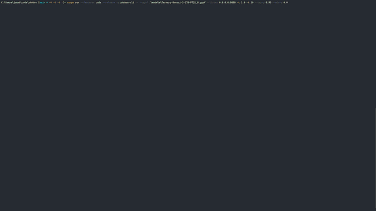
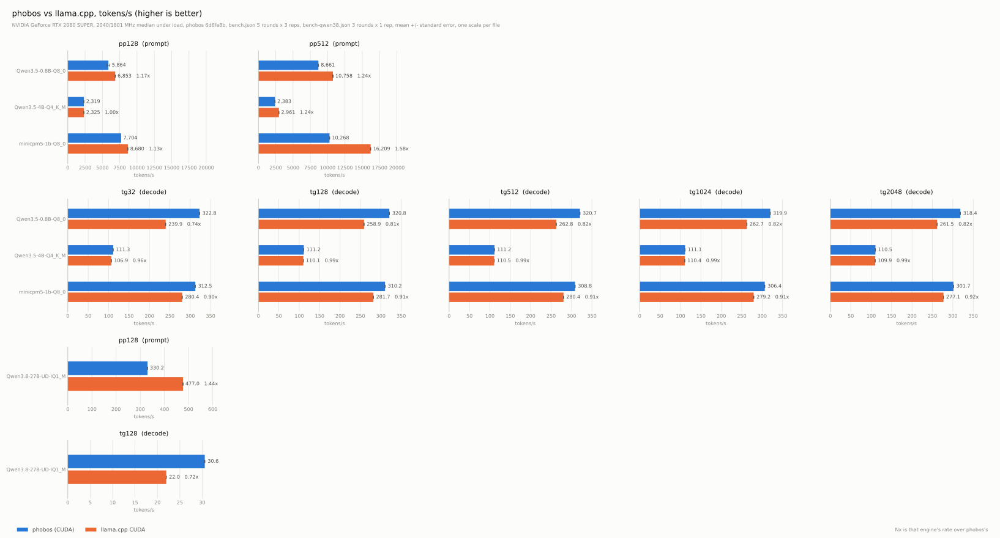

# phobos

**EXPERIMENTAL** Tile-based kernel language for distributed tensor algebra. Inspired by [Triton](https://triton-lang.org).

```plain
@cluster(TILE_M in [16384, 65536], TILE_N in [16384, 65536], TILE_K in [16384, 65536])
@autotune(TILE_M in [32, 256], TILE_N in [32, 256], TILE_K in [4, 32])
kernel gemm(A: tensor<f32>[M, K],
            B: tensor<f32>[K, N],
            C: tensor<f32>[M, N],
            alpha: f32,
            beta: f32) {
  let pm = program_id(0)
  let pn = program_id(1)

  var acc: tile<f32>[TILE_M, TILE_N] = 0.0
  
  for kt in range(0, K, TILE_K) {
    var a = A[pm * TILE_M :+ TILE_M, kt :+ TILE_K]
    var b = B[kt :+ TILE_K, pn * TILE_N :+ TILE_N]
    acc += dot(a, b)
  }
  
  let c_old = C[pm * TILE_M :+ TILE_M, pn * TILE_N :+ TILE_N]
  C[pm * TILE_M :+ TILE_M, pn * TILE_N :+ TILE_N] = alpha * acc + beta * c_old
}
```

SGEMM performance is at 76% throughput of cuBLAS `cublasSgemm_v2` on a 2080 SUPER[^1] for `M=N=K=4096` fp32.
The same language runs LLM inference end to end: a quantized GGUF model running on phobos kernels generates at or above llama.cpp's rate on that card, from a 0.8B Q8_0 to two 27Bs, IQ1_M and ternary PTQ1_0, that only just fit in its VRAM, and a 35B mixture of experts whose experts do not fit at all and stream from host memory. The prompt pass trails on the small models and leads on both 27Bs and the 35B; [Inference](#inference) gives both.


## Language

See [SPEC](./SPEC.md) for details or check out the [`examples/`](./examples).

## Autotuning

Phobos supports autotuning for finding the optimal configuration. 


## Inference

Frontends for ONNX and GGUF sit atop the language and `phobos-cli` executes them.

Inference has been tested with:

- [MiniCPM5-1B-Q8_0](https://huggingface.co/Abiray/MiniCPM5-1B-GGUF)
- [Qwen3.5-0.8B-Q8_0](https://huggingface.co/ggml-org/Qwen3.5-0.8B-GGUF)
- Qwen3.5-4B-Q4_K_M
- Qwen3.8-27B-UD-IQ1_M
- Ternary-Bonsai-2-27B-PTQ1_0
- [GPT2 (ONNX)](https://github.com/onnx/models/tree/main/validated/text/machine_comprehension/gpt-2)

`--listen ADDR` serves an OpenAI-compatible API and puts a dashboard on the terminal: the card and
its driver, the weight footprint, VRAM as one stacked bar of weights, key/value cache and everything
else on the card, the context in use against the limit and what the rest of it would cost, the block
layout with its attention and recurrent share, the cache hit rates, and the prompt and decode rates
as they are measured.

A cold start compiles every kernel from source, which takes minutes; a warm one reads them back from
`~/.phobos/kernel-cache` in seconds. Either way it reports what it is doing: a line per kernel with
`--no-tui`, and on the dashboard a progress bar beside the kernel itself, its own text going in one
side and the PTX it became coming out the other, with a histogram of how long each one took and how
much PTX a character of kernel text turns into. The cache is keyed on a fingerprint of every `.rs` under
the crates that lower a kernel, so editing `phobos-base`, `phobos-kernels`, `phobos-lang` or
`phobos-mlir` costs one cold start even when the generated PTX could not have changed.

The server keeps a finished request's session and reuses as much of it as the next request's prompt
agrees with, so a chat re-sending its whole transcript only runs the new turn. How far it can reuse
depends on the architecture: plain attention rewinds to any shared position, while a model with
recurrent blocks, such as a Qwen3.5, carries state that summarises every token it has seen and can
only be continued, never rewound. `--no-prefix-cache` turns it off and hands the cache's buffers
back for a pass to use as scratch, which is the difference on a card that only just fits. `--no-tui` turns it off, as does output that
is not a terminal or a `PHOBOS_VRAM`/`PHOBOS_PASS_REPORT` left set in the environment, since those
write to stderr from inside a pass and would land on top of it. Whenever the dashboard is skipped
the reason is printed; `--tui` draws one regardless.

**Note:**
* The host backend is used for verification and *very* slow. Always build with `--features=cuda` unless you need to verify against the host oracle. Always build with `--release` if the host backend is used.
* ONNX has not seen a lot of love (as in: it runs the OG GPT-2, but it's slow).

Two model front ends, each with a host backend and a GPU one:

- **`phobos-gguf`**: This has been verified against llama.cpp (token for token where greedy decoding is stable, 
  and by next-token logit gaps where it is not).
- **`phobos-onnx`**: ONNX protobuf to a graph IR, then shape inference, constant folding, LayerNorm
  and epilogue fusion. GPT-2 runs end to end and has been verified against its bundled reference, with a KV-cache path.

Qwen3.5-0.8B-Q8_0 on an RTX 2080 SUPER, driver 610.88, tokens per second:

| test   | llama.cpp CUDA[^2]  | Phobos GPU         |
| ------ | ------------------: | -----------------: |
| pp128  |  6865.64 +/-  20.15 | 5598.11 +/- 192.96 |
| pp512  | 10871.30 +/-   9.37 | 8491.03 +/-  17.11 |
| tg32   |   241.50 +/-   0.18 |  329.45 +/-   0.27 |
| tg128  |   260.12 +/-   0.09 |  328.37 +/-   0.14 |
| tg512  |   263.78 +/-   0.10 |  328.63 +/-   0.05 |
| tg1024 |   263.35 +/-   0.09 |  327.67 +/-   0.07 |
| tg2048 |   262.47 +/-   0.05 |  326.14 +/-   0.08 |

MiniCPM5-1B-Q8_0 on an RTX 2080 SUPER, driver 610.88, tokens per second:

| test   | llama.cpp CUDA[^2]  | Phobos GPU          |
| ------ | ------------------: | ------------------: |
| pp128  |  8613.27 +/-  30.14 |  7574.73 +/-  27.89 |
| pp512  | 16235.99 +/-  34.08 | 10114.45 +/-  20.40 |
| tg32   |   280.79 +/-   0.15 |   318.95 +/-   0.33 |
| tg128  |   281.81 +/-   0.18 |   317.78 +/-   0.18 |
| tg512  |   280.80 +/-   0.13 |   316.35 +/-   0.12 |
| tg1024 |   280.01 +/-   0.16 |   313.77 +/-   0.13 |
| tg2048 |   277.07 +/-   0.14 |   308.68 +/-   0.12 |

Qwen3.5-4B-Q4_K_M on an RTX 2080 SUPER, driver 610.88, tokens per second:

| test   | llama.cpp CUDA[^2] | Phobos GPU         |
| ------ | -----------------: | -----------------: |
| pp128  | 2317.77 +/-   1.83 | 2307.98 +/-   3.33 |
| pp512  | 2956.77 +/-   3.66 | 2352.83 +/-  24.31 |
| tg32   |  107.04 +/-   0.07 |  113.53 +/-   0.08 |
| tg128  |  110.07 +/-   0.06 |  113.29 +/-   0.05 |
| tg512  |  110.59 +/-   0.04 |  113.30 +/-   0.04 |
| tg1024 |  110.44 +/-   0.05 |  113.15 +/-   0.06 |
| tg2048 |  109.87 +/-   0.03 |  112.60 +/-   0.05 |

Qwen3.8-27B-UD-IQ1_M on an RTX 2080 SUPER, driver 610.88, tokens per second:

| test  | llama.cpp CUDA[^2] | Phobos GPU      |
| ----- | -----------------: | --------------: |
| pp128 |   476.96 +/-  1.56 | 532.60 +/- 0.74 |
| tg128 |    22.00 +/-  0.00 |  31.36 +/- 0.09 |

Ternary-Bonsai-2-27B-PTQ1_0 on an RTX 2080 SUPER, driver 610.88, tokens per second:

| test  | llama.cpp-prism CUDA[^3] | Phobos GPU       |
| ----- | -----------------------: | ---------------: |
| pp128 |         302.11 +/-  0.78 | 583.49 +/- 15.04 |
| tg128 |          29.36 +/-  0.01 |  46.12 +/-  0.01 |

Qwen3.6-35B-A3B-UD-Q4_K_M, a mixture of 256 experts whose 19.5 GB do not fit the card, on an RTX 2080 SUPER, driver 610.88, tokens per second:

| test  | llama.cpp CUDA[^2], 31 blocks' experts on the CPU, 8 threads | Phobos GPU       |
| ----- | -----------------------------------------------------------: | ---------------: |
| pp128 |                                              75.68 +/-  0.32 | 329.33 +/- 0.75  |
| pp512 |                                             256.91 +/-  0.55 | 598.85 +/- 2.13  |
| tg128 |                                              31.41 +/-  0.75 |  55.52 +/- 0.15  |

Both engines keep the 35B's trunk on the card. llama.cpp splits the experts
by layer at load, and runs at its best split and thread count for this
card, swept with `llama-bench` at a 3k context: `-ncmoe 31 -t 8`, where 30
is the edge of paging and 29 pages, and 8 threads decode 12% faster than
its default. Phobos keeps a cache of experts on the card, sized to leave
room for the context to grow. A decode step's hits run on the card while a
team of CPU threads computes its misses from host memory, in a quarter of
the time copying one over the link takes, and hands its share to the card
through mapped memory. A prompt pass copies experts over PCIe and computes
the rest on the CPU at the same time. The link is PCIe 3.0 x8 on this box,
6.4 GB/s.

#### An agent's work

The figures above are a benchmark's. `scripts/agent_bench.py` runs the
[pi](https://pi.dev) coding agent on the tasks in `bench/` against each
engine in turn, records every request the agent sends, and replays a
recording to each engine at the recorded answer lengths, so both do the
same work: the same prompts in the same order, each engine's kept session
rewound where the agent's prompts leave it. Both engines get the same
sampler, a 16k context and one slot, and llama.cpp the split above. The fib
task, 8 requests, three rounds each:

| no thinking      | wall   | prompt    | decode     |
| ---------------- | -----: | --------: | ---------: |
| llama.cpp CUDA   | 71.9 s | 132 t/s   | 29.9 t/s   |
| Phobos GPU       | 44.0 s | 237 t/s   | 42.3 t/s   |

| thinking         | wall    | prompt    | decode     | generated a round |
| ---------------- | ------: | --------: | ---------: | ----------------: |
| llama.cpp CUDA   | 149.1 s | 105 t/s   | 30.1 t/s   |             2,005 |
| Phobos GPU       | 147.8 s | 193 t/s   | 42.0 t/s   |            ~4,400 |

A replay caps each answer at the recorded length but cannot make an engine
go on, and llama.cpp ends the long reasoning turn early, so with thinking
the two walls cover different work: Phobos writes twice the tokens in the
same time. The context reaches 4k tokens without thinking and 8.6k with it,
which is why decode is slower here than in the benchmark above.

The two 27Bs, at 6.27 GiB and 5.53 GiB of weights, leave little of the card's 8 GiB,
and their figures hold only while the desktop's share stays small: the IQ1_M was
taken with 1377 MiB in use before the run, the PTQ1_0 with 979 MiB. Once the desktop
holds much more the model no longer fits and the driver pages it over PCIe, which an
earlier session measured at 7 t/s.



<details>
  <summary>Benchmark Details</summary>
  
```plain
# both engines, interleaved on a card checked for contention, which is what a
# comparison between the two columns has to be measured with. One invocation
# covers the 0.8B, MiniCPM5-1B and 4B tables above.
python scripts/bench.py -p 128 512 -n 32 128 512 1024 2048 -r 3 -R 5 \
  --csv results/bench.csv --json results/bench.json

# the 27B, which is slow enough that the sizes and repetitions have to come down,
# and close enough to the card's edge that one size a phase is what fits
python scripts/bench.py -m models/Qwen3.8-27B-UD-IQ1_M.gguf -p 128 -n 128 \
  -r 1 -R 3 --csv results/bench-qwen38.csv --json results/bench-qwen38.json

# the ternary 27B, against PrismML's llama.cpp fork, since stock llama.cpp has
# neither PTQ1_0 nor the Hadamard rotation the file carries
python scripts/bench.py -m models/Ternary-Bonsai-2-27B-PTQ1_0.gguf -p 128 -n 128 \
  -r 1 -R 3 --llama-bench ${llama_cpp_prism}/llama-bench.exe \
  --csv results/bench-bonsai.csv --json results/bench-bonsai.json

# the 35B mixture of experts, llama.cpp with the first 31 blocks' experts on
# the CPU and 8 threads, its best on this card at a 3k context
python scripts/bench.py -m models/Qwen3.6-35B-A3B-UD-Q4_K_M.gguf -p 128 512 -n 128 \
  -r 1 -R 3 --llama-args="-ncmoe 31 -t 8" \
  --csv results/bench-qwen36moe.csv --json results/bench-qwen36moe.json

# an agent's work: record a pi session, then replay it to both engines
python scripts/agent_bench.py --engines phobos -r 1 [--thinking]
python scripts/agent_bench.py -r 3 [--thinking] --replay RUN/phobos-rep1-fib.requests.jsonl \
  --llama-arg=-ncmoe --llama-arg=31 --llama-arg=-t --llama-arg=8

# the plot carries every run, a block each: one file is one visit to the card,
# and a 27B generates an order of magnitude slower, so the blocks do not share
# a scale.
python scripts/plot.py results/bench.json results/bench-qwen38.json \
  results/bench-bonsai.json results/bench-qwen36moe.json -o results/inference.svg

# either engine on its own, which measures one column and not a comparison
llama-bench -p 512 -n 128 -m ${models}/Qwen3.5-0.8B-Q8_0.gguf -r 10
cargo run --features cuda --release -p phobos-bench -- -m ${models}/Qwen3.5-0.8B-Q8_0.gguf -p 512 -n 128 -r 10

# the cuBLAS/gemm chart at the top of this file, a separate measurement:
# phobos-kbench autotunes and times its own kernels once each, no interleaving.
cargo run -r -p phobos-kbench -- --csv results/results.csv
python scripts/plot_bench.py results/results.csv -o results/bench.svg
```
</details>

#### Running Locally

1. Download [minicpm5-1b-Q8_0.gguf](https://huggingface.co/Abiray/MiniCPM5-1B-GGUF) from HuggingFace.
2. Start the inference server with recommended model settings for temp etc.
  ```plain
  cargo run --features cuda -r -p phobos-cli -- --listen 127.0.0.1:8080 --gguf ~\models\minicpm5-1b-Q8_0.gguf --temp 0.9 --top-p 0.95 -n 32768
  ```
3. [pi.dev](https://pi.dev) `~/.pi/agent/models.json` entry:
  ```json
  {
    "providers": {
      "ollama": {
        "baseUrl": "http://127.0.0.1:8080/v1",
        "api": "openai-completions",
        "apiKey": "phobos",
        "models": [
          {
            "id": "minicpm5-1b-Q8_0",
            "input": ["text"],
            "compat": {
              "supportsDeveloperRole": false,
            },
            "contextWindow": 65536,
            "maxTokens": 32768,
            "cost": { "input": 0, "output": 0, "cacheRead": 0, "cacheWrite": 0 }
          }
        ]
      }
    }
  }
  ```
4. Happy hacking!

## Clustering

Phobos supports Hierarchical AMT with lineage recovery out of the box given the language is scale-free.

- **`phobos-sched`**: A central resource manager creates the global DAG and assigns sub-DAGs to specific nodes.
- **`phobos-pod`**: A node-level runtime takes the sub-DAG and schedules the fine-grained operations (threads, network fetches, memory allocations) dynamically and out-of-order.
- Communication via gRPC (see `phobos-cluster/proto`).

### Job Definition

Jobs are defined in a text format. 

Supported I/O protocols:
- **`file://`**: Must be available to the `pod` processes (local, NFS, ...)

```plain
source = /path/to/gemm_fp32.ph
dim M = 16384
dim N = 16384
dim K = 16384
tensor A = read  f32 16384x16384 file:///data/A.bin
tensor B = read  f32 16384x16384 file:///data/B.bin
tensor C = rmw   f32 16384x16384 file:///data/C.bin
scalar alpha = f32 0.125
scalar beta  = f32 1.5
```

### Example

Running one scheduler and two pods on the same host.
Reduce VRAM to 4 GiB per pod.

1. **Start scheduler**: `cargo run -p phobos-sched -- --listen 0.0.0.0:8881 --nodes 2 --job .\examples\matmul_cluster_job.txt --autotune --vram 4294967296`
2. **Start pod 0**: `cargo run -p phobos-pod -- --id 0 --sched 127.0.0.1:8881 --listen 0.0.0.0:8882 --arena 4294967296`
3. **Start pod 1**: `cargo run -p phobos-pod -- --id 1 --sched 127.0.0.1:8881 --listen 0.0.0.0:8883 --arena 4294967296`
4. Output will be written to the job's `tensor C` URI (`file:///data/C.bin` in the example above)

```plain
$ cargo run -p phobos-sched --            \
  --listen 0.0.0.0:8881                   \
  --nodes 2                               \
  --job .\examples\matmul_cluster_job.txt \
  --autotune                              \
  --vram 4294967296
phobos-sched: listening on 0.0.0.0:8881, waiting for 2 node(s)
[  0.000s  INFO] sched: planned 'matmul' supers=[("TILE_K", 4096), ("TILE_M", 4096), ("TILE_N", 8192)] ingest=DirectLoad budget=none nodes=2 segments/node=[1, 1] peak=704MiB fetch=0MiB
[  0.077s  INFO] sched: compiled 2 leaf kernel(s)
[  0.078s  INFO] sched: waiting for 2 node(s) to register
[ 39.692s  INFO] sched: node0 registered (tile server 127.0.0.1:8882)
[ 56.587s  INFO] sched: node1 registered (tile server 127.0.0.1:8883)
[ 56.589s  INFO] sched: 2 node(s) registered: ["node0=127.0.0.1:8882", "node1=127.0.0.1:8883"]
[ 56.591s  INFO] sched: -> node0 issue segment 0 (92 instrs: 24 ALLOC, 20 LOAD, 20 COMPUTE, 4 STORE, 24 FREE; incr 704MiB)
[ 56.593s  INFO] sched: -> node1 issue segment 1 (92 instrs: 24 ALLOC, 20 LOAD, 20 COMPUTE, 4 STORE, 24 FREE; incr 704MiB)
[ 71.059s  INFO] sched: all 184 instructions accounted (184 retired, 0 abandoned)
[ 71.061s  INFO] job done; outputs:
[ 71.062s  INFO]   file:///data/C.bin
```

## Command-Line Tools

Sample kernels (`.ph`) and job files live in [`examples/`](./examples).

### `phobos-cli` (optional GPU)

```plain
cargo run [--features cuda] -r -p phobos-cli -- [--gguf <file.gguf>] [-m|--model <dir>] [--kv <dir>]
                                                [-n|--num <tokens>] [--show <int>] [--listen <host:port>]
                                                [-t|--temp <float>] [-k|--top-k <int>] [-p|--top-p <float>]
                                                [--min-p <float>]
                                                [--presence-penalty <float>] [--repetition-penalty <float>]
                                                [--seed <int>] [--raw]
                                                [prompt]
```

Perform inference. `--gguf` loads a GGUF model and dispatches on the architecture the file declares;
without it the exported ONNX engines load (`--kv` when that directory is present, else `--model`).
Uses the host backend when CUDA is not selected as a build feature; both backends produce the same logits.

Given a prompt it prints the model's answer and exits. Without one it starts a REPL that keeps the model warm and
answers each line on its own. A model whose file carries a chat template is asked in it, as the server asks it;
`--raw` sends the text as typed and prints its continuation, for a base model or text that is already a prompt.

`--listen` runs a minimal OpenAI-compatible server (`/v1/completions`, `/v1/chat/completions`, `/v1/models`)
with SSE streaming, rendering conversations and tool definitions through the model's own
`tokenizer.chat_template`. The sampling flags above become defaults unless specified otherwise in the query.

### `phobos-compile` (no GPU)

```plain
cargo run -r -p phobos-compile -- <file.ph> [--chip <sm_XY>] [--index-bits 32|64] [-o <out.ptx>]
```

Compiles a kernel source to PTX, for `sm_75` by default. `PHOBOS_PRINT_PHASES=1` prints the IR of each lowering phase.

### `phobos-bench` (needs a GPU)

```plain
cargo run --features cuda -r -p phobos-bench -- [-m <file.gguf>] [-p <N,...>] [-n <N,...>] [-d <N,...>] [-r <reps>]
```

The two numbers `llama-bench` reports for a GGUF model, in the same units: `pp<N>` is prompt processing, `tg<N>` text
generation, one row per size given. `-d` starts the generation rows at a context depth. `--help` lists the rest.

### `phobos-kbench` (needs a GPU)

```plain
cargo run -r -p phobos-kbench
```

Compiles and autotunes the bundled kernels at 4096^3 and prints throughput (against cuBLAS where a shim exists). Covers `saxpy_fp32`, `gemm_fp32`, `gemm_fp16tc_fp32acc` (tensor-core, f16 inputs with f32 accumulation), `gemm_fp16` (f16 inputs, output, and accumulation), `flash_fp32`, and `flash_fp16` (f16 Q/K/V/O with an f32 online-softmax state). Runs all of them by default; pass `--bench NAME` to run a single one, or `--help` for the full flag list. `--autotune "DIM=VAL ..."` pins the autotune dims (skipping the search) for the selected `--bench`; `--csv [PATH]` writes achieved throughput; `--peak-fp32`/`--peak-fp16tc`/`--peak-fp16tcf32acc TFLOPS` override the detected roofline peaks.

### `phobos-sched`

```plain
cargo run -r -p phobos-sched -- --listen <host:port> --nodes <n> --job <file>
                                [--budget <bytes>] [--ingest direct|home-fetch]
                                [--autotune [--vram <bytes>] [--link-bw <bytes/s>] [--leaf-flops <flop/s>]]
```

The global scheduler daemon: waits for `--nodes` pods to register, plans and dispatches the job, and prints the output tensor URIs. `--budget` enables per-node memory-budgeted segmentation; `--autotune` picks the supertile config from a cost model (overridable via `--vram`/`--link-bw`/`--leaf-flops`).

### `phobos-pod` (needs a GPU)

```plain
cargo run -r -p phobos-pod -- --id <node-id> --sched <host:port>
                               [--listen <host:port>] [--advertise <host:port>] [--arena <bytes>]
```

The node runtime daemon (one process = one GPU). Attaches to the scheduler and executes the segments it is given. Use `--listen host:0` (the default) to let the OS pick a port; `--advertise` overrides the address peers FETCH from for a multi-host cluster. `--arena` sets the device arena size (default 512 MiB).

### `phobos-tensor`

```plain
cargo run -r -p phobos-cluster --bin phobos-tensor -- init --uri <file://...> --shape <RxC|N>
                                                           [--fill zero|random|const|iota] [--value <f>] [--seed <s>]
cargo run -r -p phobos-cluster --bin phobos-tensor -- peek --uri <file://...> --shape <RxC|N>
```
Seeds and inspects the `file://` f32 tensor blobs a job reads and writes. `init` creates a blob at full size (use `--fill zero` to pre-allocate an output tensor, since STORE seeks into an existing file); `peek` prints a few well-spread elements. Shapes are row-major `RxC` (rank-2) or `N` (rank-1).

## Examples

Run with `cargo run -p <crate> --example <name> -- <args>`.

| Example | Crate | Syntax | What it does |
| --- | --- | --- | --- |
| `emit` | `phobos-lang` | `emit -- [file.ph]` | Prints the emitted MLIR (defaults to a built-in matmul). No GPU. |
| `dag_dot` | `phobos-cluster` | `dag_dot -- <file.ph> [out.dot]` | Renders a `@cluster` kernel's parametric cluster IR as Graphviz DOT. No GPU. |
| `plan_dot` | `phobos-sched` | `plan_dot -- <job.txt> [--nodes N] [--ingest direct\|home-fetch] [out.dot]` | Lowers a job to the concrete per-node instruction DAG and renders it as Graphviz DOT. No GPU. |
| `cluster_bench` | `phobos-sched` | `cluster_bench` | Analytic, CPU-only scheduler benchmark: planner throughput and cost-model quality as node count grows. No GPU. |
| `loopback` | `phobos-pod` | `loopback` | Single-node scheduler + pod smoke test over gRPC. Needs a GPU. |
| `cluster_grpc` | `phobos-pod` | `cluster_grpc` | Scheduler + two pods exercising the peer FETCH data path. Needs a GPU. |
| `budgeted` | `phobos-pod` | `budgeted` | Memory-budgeted multi-segment execution with the cluster autotuner. Needs a GPU. |
| `bench_cluster` | `phobos-pod` | `bench_cluster` | Single-GPU end-to-end cost of the cluster machinery vs. a bare full-K kernel launch. Needs a GPU. |
| `cluster_correctness` | `phobos-pod` | `cluster_correctness` | Splits one large on-disk SGEMM across several in-process nodes and sample-checks against a CPU reference. Needs a GPU. |

Render a DOT graph with Graphviz, e.g. `cargo run -p phobos-cluster --example dag_dot -- examples/matmul_cluster_fp32.ph | dot -Tsvg -o dag.svg`.

The model path has its own set. Build these `--release`, and the ones needing a GPU also `--features cuda`.

| Example | Crate | Syntax | What it does |
| --- | --- | --- | --- |
| `inspect` | `phobos-gguf` | `inspect -- MODEL.gguf [--tensors] [--dump TENSOR]` | Metadata, tensor directory by shape, quantization histogram. No GPU. |
| `generate` | `phobos-gguf` | `generate -- MODEL.gguf -n 40 "prompt"` | Host-backend generation, dispatching on the file's architecture. This is the reference path. No GPU. |
| `encode` | `phobos-gguf` | `encode -- MODEL.gguf "text"` | Token ids from the file's own tokenizer, or JSON for a JSON array of prompts. No GPU. |
| `diagnose` | `phobos-gguf` | `diagnose -- MODEL.gguf` | Per-position NLL on a repeated phrase: a flat profile means no context is reaching the current position. No GPU. |
| `inspect_onnx` | `phobos-onnx` | `inspect_onnx -- model.onnx` | Opset, inputs/outputs, op-type histogram. No GPU. |
| `run_gpt2` | `phobos-onnx` | `run_gpt2` | A real exported GPT-2 through load, fold and the host interpreter, against its bundled reference. No GPU. |
| `run_gpt2_gpu` | `phobos-onnx` | `run_gpt2_gpu` | The same model with the Gemm projections and all 25 LayerNorms on Phobos kernels. Needs a GPU. |
| `kv_check` | `phobos-onnx` | `kv_check` | A single with-past step against the last row of a full recompute. No GPU. |
| `backend_check` | `phobos-gguf` | `backend_check` | Every device op against the host reference. Needs a GPU. |
| `batch_check` | `phobos-gguf` | `batch_check -- MODEL.gguf` | A batched pass against the same tokens one at a time, and a split prompt against a whole one. Needs a GPU. |
| `model_check` | `phobos-gguf` | `model_check -- MODEL.gguf [-p PROMPT]` | Whole-model logits, device against host. Needs a GPU. |
| `fuse_check` | `phobos-gguf` | `fuse_check -- MODEL.gguf [-n STEPS]` | The fused decode path against the launched one, both on the device in one session. Needs a GPU. |
| `footprint` | `phobos-gguf` | `footprint -- MODEL.gguf` | What the model will occupy on the backend: weights, how much of that is f32, and the cache per token. Reports what the card has free under `--features cuda`. |

`phobos-gguf/examples` also holds the kernel sweeps each optimization was decided by (`q8sweep`,
`ppsweep`, `attnsweep`, `deltasweep`, `dotform`).

```
                                             ::::
                            ::-=====++++*********+-
                        =*#%@@@@@@@@@@%%##**++===++=.
                       *@@@%%%%#@@@@@%%#*++=----=+***=.
                      =#: ==.=- .*@@@%#+==--=+*#%@@@%#*=-.
                     -#+:-+=+=+=-=+#%#*+==*%@@@@@@%#**+=-+=:
                    -%#**++*++++***#%%#%%@@@@@@%##*+=:    :==-.
                   =@@@@%#######%@@@@@@@@@@@@%#**+-:        .==-.
                  *@@@@@@@%@@%%%@@@@@@@@@@%%###*++:           .-:
                .#@@@@@@@@@@@@@@@@@@@@@@@%%##***+++=.          .-.
               .*@@@@@@@@%%@%%%####**++--:..   ..:-=*+-.       -+:
               ..       .          .               :=+**+-. :=+**=.
               =.       :=.:::-=+*#*-:.  :==:       .:=+*****%##*+:
               +.       =+-+++*##%%#+-::=@@@%+:       .-+++*##***+-
              **:   :..:**+*##%@%@@%*=--#*=-::--       .-*+=****++=.
              @=:. .:..:*+++**#####*=-:::..... ..      ..-#+=***++=:
             +#::. ::..:*===++++++=--..               ....-#*=**+==:
             #+:::.:. .:*+---====---:                 :++=-=%++*+=-:.
             %++*=:.   .=+::----:::-.              -*@@@@@@%@@-++=-:.
            *@@@@*:.    .:.:--:::.::              *@@@@@@@@@@#-:+=-:.
           *@@@@@%-.       ::..:.::      .......-@@@@@@@@%*+====++-:.
            @@@@@@-.       .. . .::  ...:::::::*@@@@@@@%+*##***+=-:.
            @@@@@@+. .-----+--=-=-:..::::.:::-#@@@@@@@+=*#*++=--:..
            +@@@@@*-+@@@@@@@@@@@@#+-. ...:::=#%%%#%@#==**++=--:...
             @@@@@%%@@@@@@@@@@@@@@%%#*=-:-=+#######=-++==---::..
           -*@@@@%@@@@@@@@@@@@@@@%%%%%%#*+=+#%#%#+:-+==-----=+=-
             =@@@@@@@@@@@@@@@@@@%%%%%%@@@@@@@*%@=.-==----=+#%%%%#*=:.
       **+=-=+@@@@%@@@*+=+==+%@@%##**#%%@%*%@--=.-=--==+*%%%#####%###*=-
      *@@@@@@@##%*#%@%*=====+#%%#**+++=+++=:. .. :==++*######**++==+****
     +*****%@@*::=*##*+=-==---=***++=-:.      ..:.-*#%%%%%%%%###*+=-:.-+
    #%*=: :#%*+: :+*++:       .====-::.         :-*@@@@@@@@@@@@%%##*+:
   #%#*=. +#*++=  -=---:::::..::::::...        .#@@@@@@@@@@@@@@@@@%#*+--
  ##**+-.=#*+++-                             -#@@@@@@@@@@@@@@@@@@@@%#*+*
  #**=--*#***+                            .+@@@@@@@@@@q<3a@@@@@@@@@#**#%
  *+==+##**+:   -+*%@**+.  +#######+-+%=-*@@@@@@@@@@@@@@@@@@@@@@@@@#*#%@
  *++*##**+..=#@@@@@@@#-.-@@@@@@@@@%%@*-#@@@@@@@@@@@@@@@@@@@@@@@@@#*#@@#
  P          H                O              B            O            S
```

## AI Disclaimer

Claude Code was used, among the Gemini and Codex free tiers, when building
this project.

[^1]: [Table 2. GeForce RTX 3080 vs GeForce RTX 2080 / 2080 Super; P.14](https://www.nvidia.com/content/PDF/nvidia-ampere-ga-102-gpu-architecture-whitepaper-v2.1.pdf)
[^2]: build: 4d19b2876 (10636)
[^3]: [PrismML's llama.cpp fork](https://github.com/PrismML-Eng/llama.cpp), build: 7dffb158d (10685)
