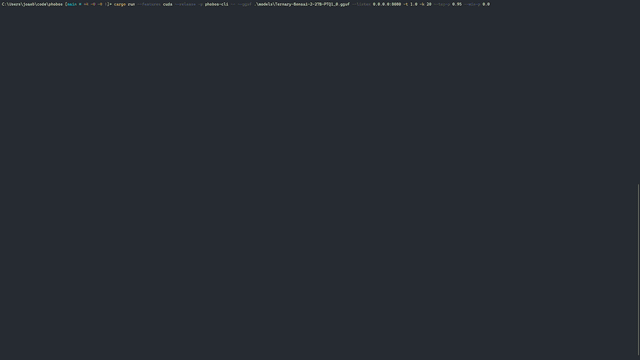
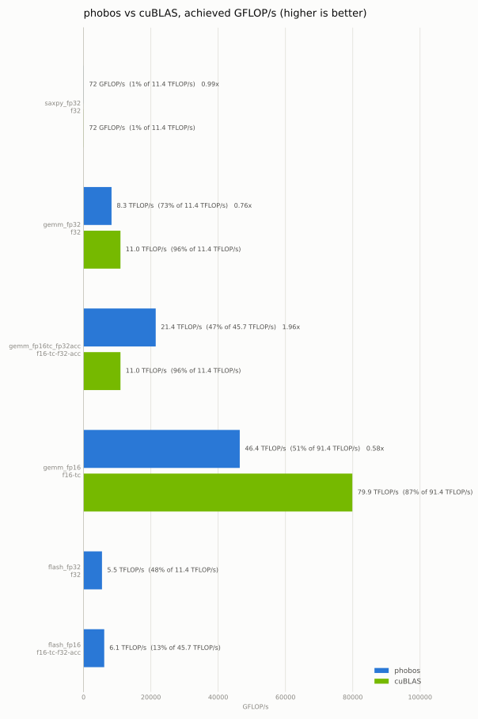
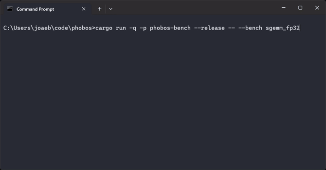
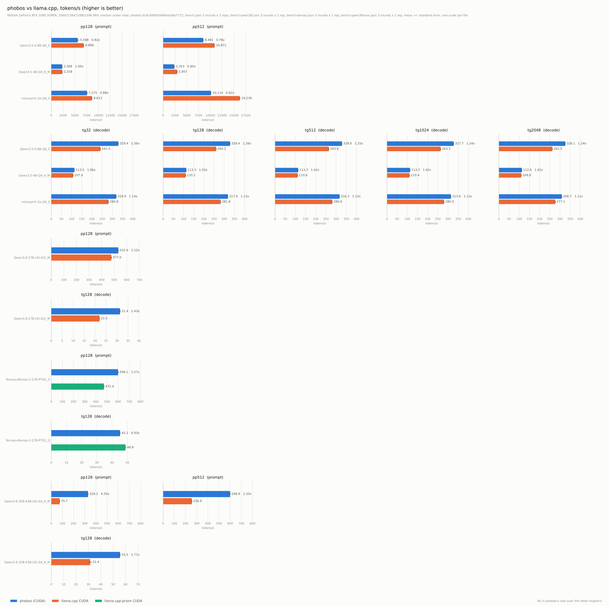

# Phobos

Phobos is a tile-based GPU kernel language and an LLM inference engine built on it. I wrote it to learn the stack on an RTX 2080 SUPER (8 GB), so it targets low-VRAM machines.

For mixture-of-experts models that don't fit in VRAM, Phobos needs no manual CPU/GPU split. It keeps an expert cache on the card and computes misses on the CPU in parallel. On Qwen3.6-35B-A3B it replays a recorded coding-agent session 1.6x faster than llama.cpp at its best swept configuration. Decode matches or beats llama.cpp on every model tested except Ternary-Bonsai, where PrismML's fork is 8% faster. Prompt processing on small dense models is 60–80% of llama.cpp.

I come from compilers and virtual machines, not AI, which shaped several design choices. Phobos will understand your architecture as it performs inference and chooses the best runtime configuration.

Phobos is **very** fast for highly quantized models such as Ternary-Bonsai-2-27B-PTQ1_0.

## Components

- **[Compiler](#compiler)**: Tile-based kernel language inspired by [Triton](https://triton-lang.org). Currently CUDA-only, 76% SGEMM cuBLAS throughput.
- **[Inference](#inference)**: OpenAI compatible server for GGUF models. Kernel fusion, memory management; decodes at or above llama.cpp's rate. 
- **[Clustering](#clustering)**: Distributed tensor algebra.

## Compiler

```plain
@cluster(TILE_M in [16384, 65536], TILE_N in [16384, 65536], TILE_K in [16384, 65536])
@autotune(TILE_M in [32, 256], TILE_N in [32, 256], TILE_K in [4, 32])
kernel gemm(A: tensor<f32>[M, K],
            B: tensor<f32>[K, N],
            C: tensor<f32>[M, N],
            alpha: f32,
            beta: f32) {
  let pm = program_id(0)
  let pn = program_id(1)

  var acc: tile<f32>[TILE_M, TILE_N] = 0.0
  
  for kt in range(0, K, TILE_K) {
    var a = A[pm * TILE_M :+ TILE_M, kt :+ TILE_K]
    var b = B[kt :+ TILE_K, pn * TILE_N :+ TILE_N]
    acc += dot(a, b)
  }
  
  let c_old = C[pm * TILE_M :+ TILE_M, pn * TILE_N :+ TILE_N]
  C[pm * TILE_M :+ TILE_M, pn * TILE_N :+ TILE_N] = alpha * acc + beta * c_old
}
```

LLVM/MLIR based compiler. SGEMM performance is at 76% throughput of cuBLAS `cublasSgemm_v2` on a 2080 SUPER[^1] for `M=N=K=4096` fp32.

See [SPEC](./SPEC.md) for details or check out the [`examples/`](./examples).



### Autotuning

Phobos supports autotuning for finding the optimal configuration. 



## Inference

The same language runs LLM inference end to end. On the RTX 2080 SUPER, quantized GGUF models on Phobos kernels generate text as fast as llama.cpp or faster. This holds for:

- small models, such as a 0.8B at Q8_0
- two 27B models, IQ1_M and ternary PTQ1_0, that barely fit in VRAM
- a 35B mixture of experts whose experts do not fit at all and stream from host memory

Frontends for GGUF and ONNX sit atop the language and `phobos-cli` executes them. `--listen ADDR` serves an OpenAI-compatible API and puts a dashboard on the terminal.

Inference has been tested with:

- [MiniCPM5-1B-Q8_0](https://huggingface.co/Abiray/MiniCPM5-1B-GGUF)
- [Qwen3.5-0.8B-Q8_0](https://huggingface.co/ggml-org/Qwen3.5-0.8B-GGUF)
- Qwen3.5-4B-Q4_K_M
- Qwen3.8-27B-UD-IQ1_M
- Ternary-Bonsai-2-27B-PTQ1_0
- Qwen3.6-35B-A3B-UD-Q4_K_M
- GLM-4.6V-Flash-Q4_K_M (text only)
- [GPT2 (ONNX)](https://github.com/onnx/models/tree/main/validated/text/machine_comprehension/gpt-2)

**Note:**
* The host backend is used for verification and *very* slow. Always build with `--features=cuda` unless you need to verify against the host oracle. Always build with `--release` if the host backend is used.
* ONNX has not seen a lot of love (as in: it runs the OG GPT-2, but it's slow).

- **`phobos-gguf`**: This has been verified against llama.cpp (token for token where greedy decoding is stable, 
  and by next-token logit gaps where it is not).
- **`phobos-onnx`**: ONNX protobuf to a graph IR, then shape inference, constant folding, LayerNorm
  and epilogue fusion. GPT-2 runs end to end and has been verified against its bundled reference, with a KV-cache path.

### Benchmarks



See [BENCHMARKS](./BENCHMARKS.md) for detailed results and more information.

#### Running Locally

1. Download [minicpm5-1b-Q8_0.gguf](https://huggingface.co/Abiray/MiniCPM5-1B-GGUF) from HuggingFace.
2. Start the inference server with recommended model settings for temp etc.
  ```plain
  cargo run --features cuda -r -p phobos-cli -- --listen 127.0.0.1:8080 --gguf ~\models\minicpm5-1b-Q8_0.gguf --temp 0.9 --top-p 0.95 -n 32768
  ```
3. [pi.dev](https://pi.dev) `~/.pi/agent/models.json` entry:
  ```json
  {
    "providers": {
      "ollama": {
        "baseUrl": "http://127.0.0.1:8080/v1",
        "api": "openai-completions",
        "apiKey": "phobos",
        "models": [
          {
            "id": "minicpm5-1b-Q8_0",
            "input": ["text"],
            "compat": {
              "supportsDeveloperRole": false,
            },
            "contextWindow": 65536,
            "maxTokens": 32768,
            "cost": { "input": 0, "output": 0, "cacheRead": 0, "cacheWrite": 0 }
          }
        ]
      }
    }
  }
  ```
4. Happy hacking!

## Clustering

The language is scale-free, so the same kernel runs on a cluster without changes. The cluster runtime is a hierarchical asynchronous many-task (AMT) system with lineage recovery.

- **`phobos-sched`**: A central resource manager creates the global DAG and assigns sub-DAGs to specific nodes.
- **`phobos-pod`**: A node-level runtime takes the sub-DAG and schedules the fine-grained operations (threads, network fetches, memory allocations) dynamically and out-of-order.
- Communication via gRPC (see `phobos-cluster/proto`).

### Job Definition

Jobs are defined in a text format. 

Supported I/O protocols:
- **`file://`**: Must be available to the `pod` processes (local, NFS, ...)

```plain
source = /path/to/gemm_fp32.ph
dim M = 16384
dim N = 16384
dim K = 16384
tensor A = read  f32 16384x16384 file:///data/A.bin
tensor B = read  f32 16384x16384 file:///data/B.bin
tensor C = rmw   f32 16384x16384 file:///data/C.bin
scalar alpha = f32 0.125
scalar beta  = f32 1.5
```

### Example

Running one scheduler and two pods on the same host.
Reduce VRAM to 4 GiB per pod.

1. **Start scheduler**: `cargo run -p phobos-sched -- --listen 0.0.0.0:8881 --nodes 2 --job .\examples\matmul_cluster_job.txt --autotune --vram 4294967296`
2. **Start pod 0**: `cargo run -p phobos-pod -- --id 0 --sched 127.0.0.1:8881 --listen 0.0.0.0:8882 --arena 4294967296`
3. **Start pod 1**: `cargo run -p phobos-pod -- --id 1 --sched 127.0.0.1:8881 --listen 0.0.0.0:8883 --arena 4294967296`
4. Output will be written to the job's `tensor C` URI (`file:///data/C.bin` in the example above)

```plain
$ cargo run -p phobos-sched --            \
  --listen 0.0.0.0:8881                   \
  --nodes 2                               \
  --job .\examples\matmul_cluster_job.txt \
  --autotune                              \
  --vram 4294967296
phobos-sched: listening on 0.0.0.0:8881, waiting for 2 node(s)
[  0.000s  INFO] sched: planned 'matmul' supers=[("TILE_K", 4096), ("TILE_M", 4096), ("TILE_N", 8192)] ingest=DirectLoad budget=none nodes=2 segments/node=[1, 1] peak=704MiB fetch=0MiB
[  0.077s  INFO] sched: compiled 2 leaf kernel(s)
[  0.078s  INFO] sched: waiting for 2 node(s) to register
[ 39.692s  INFO] sched: node0 registered (tile server 127.0.0.1:8882)
[ 56.587s  INFO] sched: node1 registered (tile server 127.0.0.1:8883)
[ 56.589s  INFO] sched: 2 node(s) registered: ["node0=127.0.0.1:8882", "node1=127.0.0.1:8883"]
[ 56.591s  INFO] sched: -> node0 issue segment 0 (92 instrs: 24 ALLOC, 20 LOAD, 20 COMPUTE, 4 STORE, 24 FREE; incr 704MiB)
[ 56.593s  INFO] sched: -> node1 issue segment 1 (92 instrs: 24 ALLOC, 20 LOAD, 20 COMPUTE, 4 STORE, 24 FREE; incr 704MiB)
[ 71.059s  INFO] sched: all 184 instructions accounted (184 retired, 0 abandoned)
[ 71.061s  INFO] job done; outputs:
[ 71.062s  INFO]   file:///data/C.bin
```

## Command-Line Tools

Sample kernels (`.ph`) and job files live in [`examples/`](./examples).

### `phobos-cli` (optional GPU)

```plain
cargo run [--features cuda] -r -p phobos-cli -- [--gguf <file.gguf>] [-m|--model <dir>] [--kv <dir>]
                                                [-n|--num <tokens>] [--show <int>] [--listen <host:port>]
                                                [-t|--temp <float>] [-k|--top-k <int>] [-p|--top-p <float>]
                                                [--min-p <float>]
                                                [--presence-penalty <float>] [--repetition-penalty <float>]
                                                [--seed <int>] [--raw]
                                                [prompt]
```

Runs inference.

- `--gguf` loads a GGUF model and picks the forward pass from the architecture named in the file.
- Without `--gguf`, it loads the exported ONNX engines: from `--kv` if that directory exists, otherwise from `--model`.
- Without the `cuda` build feature it runs on the host backend. Both backends produce the same logits.

With a prompt, it prints the model's answer and exits. Without one, it starts a REPL. The model stays loaded,
and each line is answered on its own.

If the model file has a chat template, your text is sent through it, the same way the server does it.
`--raw` skips the template and prints the model's continuation of your text. Use it for base models, or for text
that is already a complete prompt.

`--listen` starts a minimal OpenAI-compatible server:

- endpoints: `/v1/completions`, `/v1/chat/completions` and `/v1/models`
- responses stream over SSE
- conversations and tool definitions are rendered with the model's own `tokenizer.chat_template`
- the sampling flags above become defaults, and a request can override them

### `phobos-compile` (no GPU)

```plain
cargo run -r -p phobos-compile -- <file.ph> [--chip <sm_XY>] [--index-bits 32|64] [-o <out.ptx>]
```

Compiles a kernel source to PTX, for `sm_75` by default. `PHOBOS_PRINT_PHASES=1` prints the IR of each lowering phase.

### `phobos-bench` (needs a GPU)

```plain
cargo run --features cuda -r -p phobos-bench -- [-m <file.gguf>] [-p <N,...>] [-n <N,...>] [-d <N,...>] [-r <reps>]
```

Measures a GGUF model the way `llama-bench` does, in the same units:

- `pp<N>`: prompt processing speed for an N-token prompt
- `tg<N>`: text generation speed over N tokens

It prints one row per size. `-d N` runs the generation rows with N tokens already in the context. `--help` lists
the other flags.

### `phobos-kbench` (needs a GPU)

```plain
cargo run -r -p phobos-kbench
```

Compiles and autotunes the bundled kernels at 4096^3 and prints their throughput, next to cuBLAS where a comparison
exists. The kernels:

- `saxpy_fp32`
- `gemm_fp32`
- `gemm_fp16tc_fp32acc`: tensor cores, f16 inputs, f32 accumulation
- `gemm_fp16`: f16 inputs, output and accumulation
- `flash_fp32`
- `flash_fp16`: f16 Q/K/V/O, f32 online-softmax state

It runs all of them by default. Useful flags:

- `--bench NAME` runs a single kernel
- `--autotune "DIM=VAL ..."` fixes the tuning values for the selected `--bench` and skips the search
- `--csv [PATH]` writes the achieved throughput to a CSV file
- `--peak-fp32`, `--peak-fp16tc` and `--peak-fp16tcf32acc TFLOPS` override the detected peak throughput
- `--help` lists every flag

### `phobos-sched`

```plain
cargo run -r -p phobos-sched -- --listen <host:port> --nodes <n> --job <file>
                                [--budget <bytes>] [--ingest direct|home-fetch]
                                [--autotune [--vram <bytes>] [--link-bw <bytes/s>] [--leaf-flops <flop/s>]]
```

The global scheduler daemon. It waits for `--nodes` pods to register, plans the job, sends each pod its part, and
prints the URIs of the output tensors.

- `--budget` splits each node's work into segments that fit a memory budget.
- `--autotune` picks the supertile sizes from a cost model. `--vram`, `--link-bw` and `--leaf-flops` override the
  model's inputs.

### `phobos-pod` (needs a GPU)

```plain
cargo run -r -p phobos-pod -- --id <node-id> --sched <host:port>
                               [--listen <host:port>] [--advertise <host:port>] [--arena <bytes>]
```

The node runtime daemon. One process drives one GPU. It connects to the scheduler and runs the segments it is given.

- `--listen host:0`, the default, lets the OS pick a port.
- `--advertise` sets the address other pods fetch data from. A cluster across several hosts needs it.
- `--arena` sets the size of the device memory arena (default 512 MiB).

### `phobos-tensor`

```plain
cargo run -r -p phobos-cluster --bin phobos-tensor -- init --uri <file://...> --shape <RxC|N>
                                                           [--fill zero|random|const|iota] [--value <f>] [--seed <s>]
cargo run -r -p phobos-cluster --bin phobos-tensor -- peek --uri <file://...> --shape <RxC|N>
```

Creates and inspects the `file://` f32 tensor files a job reads and writes.

- `init` creates a file at its full size. Output tensors need this too, because STORE writes into an existing
  file. Use `--fill zero` for them.
- `peek` prints a few elements spread across the tensor.

Shapes are row-major: `RxC` for rank 2, `N` for rank 1.

## Examples

Run with `cargo run -p <crate> --example <name> -- <args>`.

| Example | Crate | Syntax | What it does |
| --- | --- | --- | --- |
| `emit` | `phobos-lang` | `emit -- [file.ph]` | Prints the emitted MLIR (defaults to a built-in matmul). No GPU. |
| `dag_dot` | `phobos-cluster` | `dag_dot -- <file.ph> [out.dot]` | Renders a `@cluster` kernel's parametric cluster IR as Graphviz DOT. No GPU. |
| `plan_dot` | `phobos-sched` | `plan_dot -- <job.txt> [--nodes N] [--ingest direct\|home-fetch] [out.dot]` | Lowers a job to the concrete per-node instruction DAG and renders it as Graphviz DOT. No GPU. |
| `cluster_bench` | `phobos-sched` | `cluster_bench` | Analytic, CPU-only scheduler benchmark: planner throughput and cost-model quality as node count grows. No GPU. |
| `loopback` | `phobos-pod` | `loopback` | Single-node scheduler + pod smoke test over gRPC. Needs a GPU. |
| `cluster_grpc` | `phobos-pod` | `cluster_grpc` | Scheduler + two pods exercising the peer FETCH data path. Needs a GPU. |
| `budgeted` | `phobos-pod` | `budgeted` | Memory-budgeted multi-segment execution with the cluster autotuner. Needs a GPU. |
| `bench_cluster` | `phobos-pod` | `bench_cluster` | Single-GPU end-to-end cost of the cluster machinery vs. a bare full-K kernel launch. Needs a GPU. |
| `cluster_correctness` | `phobos-pod` | `cluster_correctness` | Splits one large on-disk SGEMM across several in-process nodes and sample-checks against a CPU reference. Needs a GPU. |

Render a DOT graph with Graphviz, e.g. `cargo run -p phobos-cluster --example dag_dot -- examples/matmul_cluster_fp32.ph | dot -Tsvg -o dag.svg`.

The model path has its own set. Build these `--release`, and the ones needing a GPU also `--features cuda`.

| Example | Crate | Syntax | What it does |
| --- | --- | --- | --- |
| `inspect` | `phobos-gguf` | `inspect -- MODEL.gguf [--tensors] [--dump TENSOR]` | Metadata, tensor directory by shape, quantization histogram. No GPU. |
| `generate` | `phobos-gguf` | `generate -- MODEL.gguf -n 40 "prompt"` | Host-backend generation, dispatching on the file's architecture. This is the reference path. No GPU. |
| `encode` | `phobos-gguf` | `encode -- MODEL.gguf "text"` | Token ids from the file's own tokenizer, or JSON for a JSON array of prompts. No GPU. |
| `diagnose` | `phobos-gguf` | `diagnose -- MODEL.gguf` | Loss per position on a repeated phrase. If it stays flat, the model is not using its context. No GPU. |
| `inspect_onnx` | `phobos-onnx` | `inspect_onnx -- model.onnx` | Opset, inputs/outputs, op-type histogram. No GPU. |
| `run_gpt2` | `phobos-onnx` | `run_gpt2` | A real exported GPT-2 through load, fold and the host interpreter, against its bundled reference. No GPU. |
| `run_gpt2_gpu` | `phobos-onnx` | `run_gpt2_gpu` | The same model with the Gemm projections and all 25 LayerNorms on Phobos kernels. Needs a GPU. |
| `kv_check` | `phobos-onnx` | `kv_check` | One decode step using the KV cache, checked against a full recompute. No GPU. |
| `backend_check` | `phobos-gguf` | `backend_check` | Every device op against the host reference. Needs a GPU. |
| `batch_check` | `phobos-gguf` | `batch_check -- MODEL.gguf` | A batched pass against the same tokens one at a time, and a split prompt against a whole one. Needs a GPU. |
| `model_check` | `phobos-gguf` | `model_check -- MODEL.gguf [-p PROMPT]` | Whole-model logits, device against host. Needs a GPU. |
| `fuse_check` | `phobos-gguf` | `fuse_check -- MODEL.gguf [-n STEPS]` | The fused decode path against the launched one, both on the device in one session. Needs a GPU. |
| `footprint` | `phobos-gguf` | `footprint -- MODEL.gguf` | What the model will occupy on the backend: weights, how much of that is f32, and the cache per token. Reports what the card has free under `--features cuda`. |

`phobos-gguf/examples` also holds the kernel sweeps each optimization was decided by (`q8sweep`,
`ppsweep`, `attnsweep`, `deltasweep`, `dotform`).

```
                                             ::::
                            ::-=====++++*********+-
                        =*#%@@@@@@@@@@%%##**++===++=.
                       *@@@%%%%#@@@@@%%#*++=----=+***=.
                      =#: ==.=- .*@@@%#+==--=+*#%@@@%#*=-.
                     -#+:-+=+=+=-=+#%#*+==*%@@@@@@%#**+=-+=:
                    -%#**++*++++***#%%#%%@@@@@@%##*+=:    :==-.
                   =@@@@%#######%@@@@@@@@@@@@%#**+-:        .==-.
                  *@@@@@@@%@@%%%@@@@@@@@@@%%###*++:           .-:
                .#@@@@@@@@@@@@@@@@@@@@@@@%%##***+++=.          .-.
               .*@@@@@@@@%%@%%%####**++--:..   ..:-=*+-.       -+:
               ..       .          .               :=+**+-. :=+**=.
               =.       :=.:::-=+*#*-:.  :==:       .:=+*****%##*+:
               +.       =+-+++*##%%#+-::=@@@%+:       .-+++*##***+-
              **:   :..:**+*##%@%@@%*=--#*=-::--       .-*+=****++=.
              @=:. .:..:*+++**#####*=-:::..... ..      ..-#+=***++=:
             +#::. ::..:*===++++++=--..               ....-#*=**+==:
             #+:::.:. .:*+---====---:                 :++=-=%++*+=-:.
             %++*=:.   .=+::----:::-.              -*@@@@@@%@@-++=-:.
            *@@@@*:.    .:.:--:::.::              *@@@@@@@@@@#-:+=-:.
           *@@@@@%-.       ::..:.::      .......-@@@@@@@@%*+====++-:.
            @@@@@@-.       .. . .::  ...:::::::*@@@@@@@%+*##***+=-:.
            @@@@@@+. .-----+--=-=-:..::::.:::-#@@@@@@@+=*#*++=--:..
            +@@@@@*-+@@@@@@@@@@@@#+-. ...:::=#%%%#%@#==**++=--:...
             @@@@@%%@@@@@@@@@@@@@@%%#*=-:-=+#######=-++==---::..
           -*@@@@%@@@@@@@@@@@@@@@%%%%%%#*+=+#%#%#+:-+==-----=+=-
             =@@@@@@@@@@@@@@@@@@%%%%%%@@@@@@@*%@=.-==----=+#%%%%#*=:.
       **+=-=+@@@@%@@@*+=+==+%@@%##**#%%@%*%@--=.-=--==+*%%%#####%###*=-
      *@@@@@@@##%*#%@%*=====+#%%#**+++=+++=:. .. :==++*######**++==+****
     +*****%@@*::=*##*+=-==---=***++=-:.      ..:.-*#%%%%%%%%###*+=-:.-+
    #%*=: :#%*+: :+*++:       .====-::.         :-*@@@@@@@@@@@@%%##*+:
   #%#*=. +#*++=  -=---:::::..::::::...        .#@@@@@@@@@@@@@@@@@%#*+--
  ##**+-.=#*+++-                             -#@@@@@@@@@@@@@@@@@@@@%#*+*
  #**=--*#***+                            .+@@@@@@@@@@q<3a@@@@@@@@@#**#%
  *+==+##**+:   -+*%@**+.  +#######+-+%=-*@@@@@@@@@@@@@@@@@@@@@@@@@#*#%@
  *++*##**+..=#@@@@@@@#-.-@@@@@@@@@%%@*-#@@@@@@@@@@@@@@@@@@@@@@@@@#*#@@#
  P          H                O              B            O            S
```

## AI Disclaimer

Claude Code was used, alongside the Gemini and Codex free tiers, when building
this project.

[^1]: [Table 2. GeForce RTX 3080 vs GeForce RTX 2080 / 2080 Super; P.14](https://www.nvidia.com/content/PDF/nvidia-ampere-ga-102-gpu-architecture-whitepaper-v2.1.pdf)
